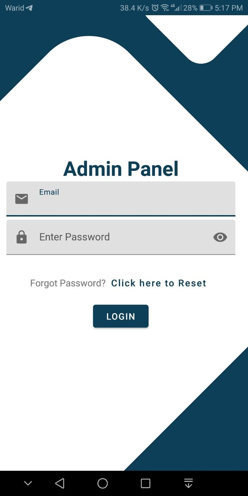
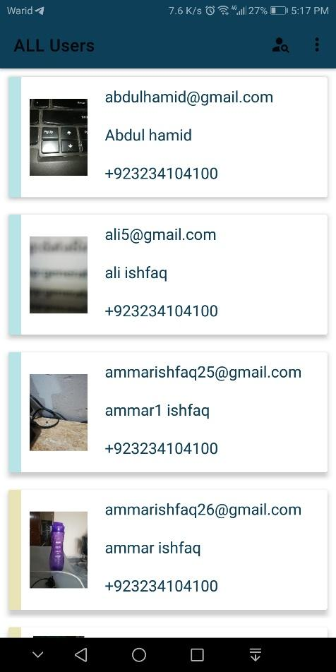
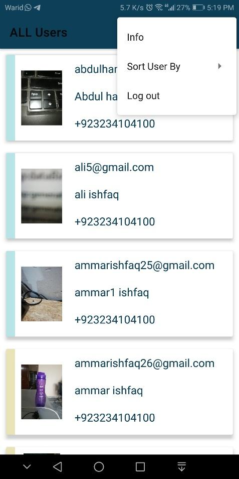
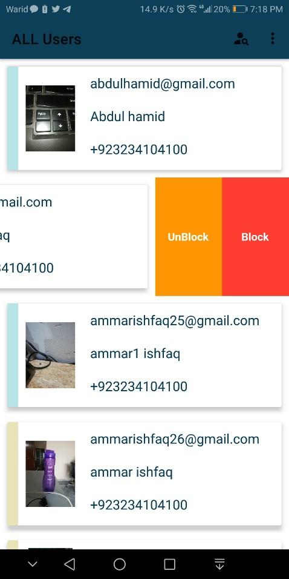
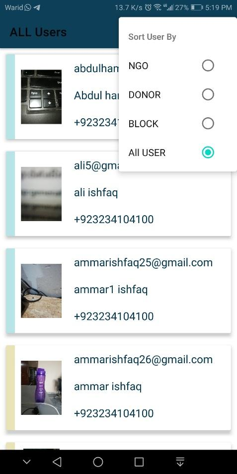
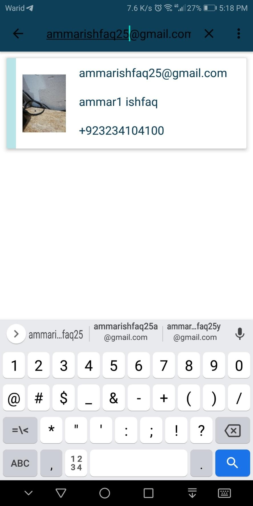

# Admin NGO Management App

## Overview

This repository houses the Admin NGO Management App, tailored for efficient administrative control. You can find the application [here](https://github.com/Ammar-Ishfaq/NGOs-Managment-2021).

## Features

- **Admin Panel:** Simplify user management with the dedicated admin panel.
- **Contribution Tracking:** Enable donors to easily monitor and track their contributions.
- **Mapbox SDK Version:** Utilizes Mapbox SDK version 9 (note the deprecated Mapbox version).

## Dependencies

Ensure the following dependencies are in place to run the project:

- Firebase Realtime Database
- Firebase Authentication
- Mapbox Key (insert into `build.gradle` file)

## How to Run

1. Add your Mapbox key to the `build.gradle` file.
2. Set up Firebase Realtime Database and Authentication.
3. Run the project.

## Contributions and Issues

Contributions and issues are encouraged! For contributions, check the [contribution guidelines](CONTRIBUTING.md). If you encounter issues or have suggestions, [create an issue](https://github.com/Ammar-Ishfaq/NGOs-Managment-2021-Admin/issues).

## Project Images

| Image Preview | Image Preview | Image Preview | Image Preview |
| -------------- | -------------- | -------------- | -------------- |
|  |  |  |  |
|  |  |               |

## License

This project is licensed under the [MIT License](LICENSE).
